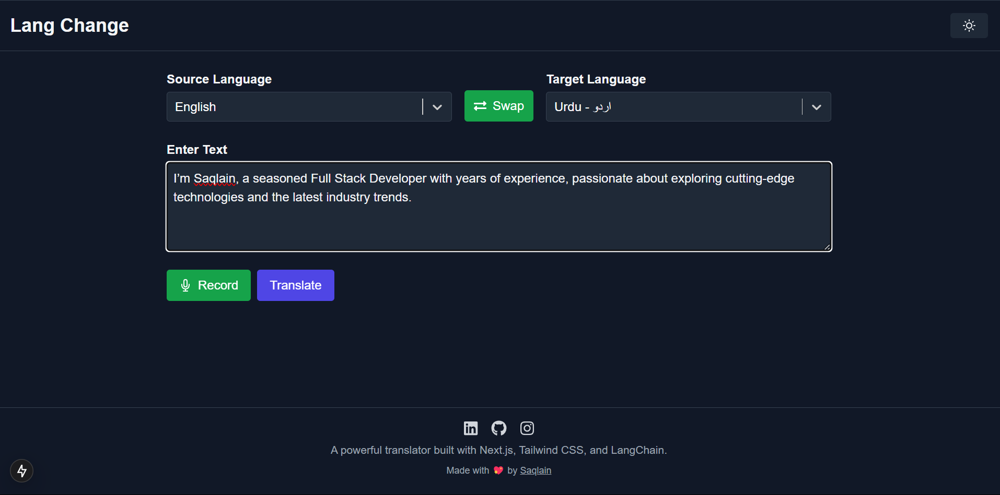

```markdown
# Lang Chnage Translator with LangChain, LangSmith & Open AI

A modern, responsive language translator built with Next.js, TypeScript, Tailwind CSS, and powered by LangChain’s LLM integrations (using OpenAI's GPT-3.5-turbo) with enhanced observability through LangSmith.

## Table of Contents
- [Overview](#overview)
- [Features](#features)
- [Prerequisites](#prerequisites)
- [Setup & Installation](#setup--installation)
- [Configuration](#configuration)
  - [Obtain OpenAI API Key](#obtain-openai-api-key)
  - [Obtain LangSmith API Key](#obtain-langsmith-api-key)
- [Running the App](#running-the-app)
- [LangChain & LangSmith](#langchain--langsmith)
- [Usage](#usage)
- [Contributing](#contributing)
- [License](#license)
- [Contact](#contact)

## Overview

This project is a full-stack language translator application that allows users to input text (or record voice) in one language and translate it into another. It leverages LangChain for managing language model interactions and LangSmith for detailed observability, all wrapped in a sleek Next.js interface with dark/light mode support.



## Features

- **Responsive UI** with dark/light mode toggling
- **Voice Input** using the Web Speech API
- **Dynamic Language Detection** that auto-selects the source language based on user input
- **Searchable Dropdowns** for source and target languages
- **Powered by OpenAI** with GPT-3.5-turbo for accurate translations
- **Observability** via LangSmith for debugging and monitoring LLM calls

## Prerequisites

- [Node.js](https://nodejs.org/en/) (v14 or later)
- [npm](https://www.npmjs.com/) or [yarn](https://yarnpkg.com/)
- A code editor (e.g., Visual Studio Code)

**Required Packages:**
- `@langchain/core`  
- `@langchain/openai`  
- `dotenv`  
- `langchain`  
- `react-icons`  
- `react-select`  
- `react-toastify`

You can install these packages with:
```bash
npm install @langchain/core @langchain/openai dotenv langchain react-icons react-select react-toastify

## Setup & Installation

1. **Clone the Repository**
   ```bash
   git clone https://github.com/yourusername/language-translator.git
   cd language-translator
   ```

2. **Install Dependencies**
   ```bash
   npm install
   # or
   yarn install
   ```

## Configuration

### Obtain OpenAI API Key

1. Sign up or log in at [OpenAI](https://platform.openai.com/signup).
2. Navigate to your account's API keys section.
3. Create and copy a new API key.

### Obtain LangSmith API Key

1. Sign up or log in at [smith.langchain.com](https://smith.langchain.com/).
2. Follow the onboarding steps to set up your LangSmith account.
3. Retrieve your LangSmith API key from the dashboard.

### Environment Variables

Create a `.env.local` file in the root directory and add:
```env
OPENAI_API_KEY=your-openai-api-key
LANGSMITH_TRACING=true
LANGSMITH_API_KEY=your-langsmith-api-key
```

## Running the App

Start the development server:
```bash
npm run dev
# or
yarn dev
```
Then, open [http://localhost:3000](http://localhost:3000) in your browser.

## LangChain & LangSmith

This project uses [LangChain](https://langchain.readthedocs.io/) to manage prompt templates, language model invocations, and multi-step LLM workflows. With LangChain, switching between different models or expanding your application becomes seamless.

[LangSmith](https://smith.langchain.com/) provides robust observability for your LangChain apps. By enabling tracing via `LANGSMITH_TRACING=true` and supplying your `LANGSMITH_API_KEY`, every LLM call is logged and visible on the LangSmith dashboard for debugging, performance monitoring, and token usage analysis.

## Usage

- **Dynamic Language Detection:** As you type or record voice, the app auto-detects the source language and updates the dropdown accordingly.
- **Translation:** The Translate button is enabled only when text is present. Click to perform translation using OpenAI’s GPT-3.5-turbo.
- **Voice Input:** Use the Record button to capture your voice and convert it to text.
- **Theme Toggle:** Switch between dark and light modes for an optimal viewing experience.
- **Searchable Dropdowns:** Easily search and select from a comprehensive list of languages.

## Contributing

Contributions are welcome! Please open an issue or submit a pull request for any bugs, enhancements, or new features.

## License

This project is licensed under the [MIT License](LICENSE).

## Contact

For questions or support, please reach out to [itssaqlain06@gmail.com](mailto:itssaqlain06@gmail.com).

---

If you find this project useful, please give it a ⭐

Happy Translating!